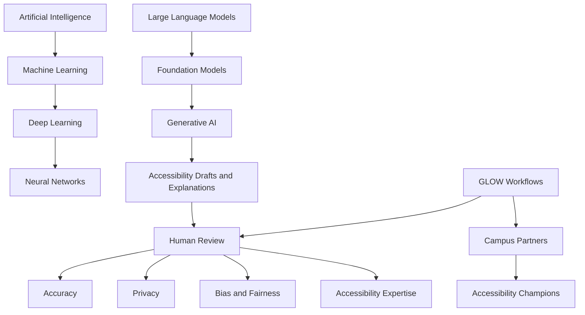

# GLOW Accessibility Champion Lab

## Six-Module AI Campus Champions Capstone Implementation Plan with VS Code, GitHub CLI, Git, Wiki, and Terminal Workflows

Prepared for: **Jeff Bishop**  
Context: **University of Arizona AI Campus Champions Summer 2026 Program**  
Capstone concept: **Human-centered AI workflows for scalable accessibility practice**  
Companion implementation milestone: **Accessing Higher Ground, October 2026**  
Primary working title: **GLOW Accessibility Champion Lab: Human-Centered AI Workflows for Scalable Accessibility Practice**  
Updated focus: **make the plan operational from the command line using VS Code, Git, GitHub CLI, the GitHub wiki, GitHub Discussions, and supporting CLI tools.**

---

## 0. What This Updated Version Adds

This version updates the original AI plan document by adding a complete implementation layer for command-line and editor-based work.

The updated plan now includes:

1. A complete `gh`, `git`, and VS Code workflow.
2. A command-line repository bootstrap process.
3. A command-line wiki creation and publishing process.
4. Module-by-module file scaffolding.
5. Module-by-module VS Code workflows.
6. Module-by-module GitHub CLI workflows.
7. Module-by-module discussion post creation workflows.
8. Module-by-module issue tracking workflows.
9. Screen-reader-friendly PowerShell scripts.
10. Safety and privacy guardrails for what should and should not be committed.
11. A final packaging process for the capstone.
12. A reusable workflow that can support the October Accessing Higher Ground milestone.

The practical goal is this:

> You should be able to run commands, open the right files in VS Code, draft artifacts, track progress in GitHub, publish polished wiki pages, prepare discussion posts, and package the final capstone without guessing where anything belongs.

---

## 1. Executive Summary

This document turns the six-week University of Arizona AI Campus Champions program into a complete, guided capstone implementation path for the **GLOW Accessibility Champion Lab**.

The official AI Campus Champions program is built around six modules. Your capstone should be positioned as a practical institutional adoption initiative:

> **The GLOW Accessibility Champion Lab helps campus partners use human-reviewed AI-supported workflows to understand accessibility barriers, improve content, and build repeatable accessibility practices while preserving human judgment, privacy, equity, and accountability.**

This is not merely a workshop proposal. It is a full responsible-AI adoption model that can be piloted at the University of Arizona and then strengthened through the October Accessing Higher Ground workshop.

The central idea remains:

> **Accessibility cannot scale when specialists are expected to fix everything. Sustainable accessibility requires helping partners understand the problem, learn the pattern, organize repeatable workflows, and walk forward as accessibility champions.**

The command-line implementation layer makes that idea real. Each module now produces files, commits, discussion drafts, wiki updates, and trackable implementation evidence.

---

## 2. Official Program and Tool Sources

Use these sources as the official program structure and technical reference points.

### 2.1 AI Campus Champions Program Sources

1. Main AI Champions Wiki:  
   `https://github.com/UA-AI2S/AI-Champions/wiki`

2. Discussion Forums:  
   `https://github.com/UA-AI2S/AI-Champions/discussions`

3. Module 1: AI Foundations:  
   `https://github.com/UA-AI2S/AI-Champions/wiki/Module-1:-AI-Foundations`

4. Module 2: Generative AI:  
   `https://github.com/UA-AI2S/AI-Champions/wiki/Module-2:-Generative-AI`

5. Module 3: AI for Productivity:  
   `https://github.com/UA-AI2S/AI-Champions/wiki/Module-3:-AI-for-Productivity`

6. Module 4: Critical Thinking About AI:  
   `https://github.com/UA-AI2S/AI-Champions/wiki/Module-4:-Critical-Thinking-About-AI`

7. Module 5: AI Governance:  
   `https://github.com/UA-AI2S/AI-Champions/wiki/Module-5.-AI-Governance`

8. Module 6: Becoming an AI Campus Champion:  
   `https://github.com/UA-AI2S/AI-Champions/wiki/Module-6:-Becoming-an-AI-Campus-Champion`

### 2.2 Tool Documentation

1. GitHub CLI manual:  
   `https://cli.github.com/manual/gh`

2. `gh repo create`:  
   `https://cli.github.com/manual/gh_repo_create`

3. `gh repo edit`:  
   `https://cli.github.com/manual/gh_repo_edit`

4. `gh discussion create`:  
   `https://cli.github.com/manual/gh_discussion_create`

5. GitHub wiki local editing:  
   `https://docs.github.com/en/communities/documenting-your-project-with-wikis/adding-or-editing-wiki-pages`

6. GitHub wiki sidebar/footer files:  
   `https://docs.github.com/en/communities/documenting-your-project-with-wikis/creating-a-footer-or-sidebar-for-your-wiki`

7. VS Code command-line interface:  
   `https://code.visualstudio.com/docs/configure/command-line`

8. VS Code profiles:  
   `https://code.visualstudio.com/docs/configure/profiles`

---

## 3. Capstone Identity

### 3.1 Recommended Capstone Title

**GLOW Accessibility Champion Lab: Human-Centered AI Workflows for Scalable Accessibility Practice**

### 3.2 Short Title for Forum Posts

**GLOW Accessibility Champion Lab**

### 3.3 One-Sentence Thesis

I am designing a human-reviewed GLOW workflow initiative that helps campus partners use AI-supported accessibility workflows to learn, practice, and improve digital accessibility while preserving human judgment, privacy, equity, and institutional responsibility.

### 3.4 Fifty-Word Problem Statement

Accessibility support does not scale when specialists are expected to fix every document, communication, course item, and web issue. Campus partners need guided, low-risk, human-reviewed AI workflows that help them learn accessibility patterns, improve content, and become accessibility champions.

### 3.5 Thirty-Second Elevator Pitch

Accessibility cannot scale if specialists are expected to fix everything. The GLOW Accessibility Champion Lab helps campus partners use human-reviewed AI workflows to understand accessibility barriers, improve content, and build repeatable habits. The goal is not to replace expertise, but to help more people become responsible accessibility champions.

### 3.6 Strongest Framing Sentence

Use this often:

> **This initiative is not about asking AI to make accessibility decisions. It is about using structured, human-reviewed AI workflows to help people learn accessibility patterns, ask better questions, and take appropriate responsibility.**

### 3.7 Final Capstone Package

By the end of the program, the repository and wiki should include:

1. A plain-language AI and accessibility glossary.
2. A concept map showing AI and accessibility capacity building.
3. A structured LLM exploration log.
4. A two-tool comparison.
5. A prompt engineering iteration log.
6. A hallucination detection checklist.
7. A tool landscape annotation table.
8. A five-task workflow audit.
9. A documented AI-assisted accessibility workflow.
10. A workflow canvas.
11. A disability/accessibility bias audit.
12. A fairness review checklist.
13. A governance principle application table.
14. A 300-word position paper.
15. A 150–200 word unit-level AI acceptable use guideline.
16. A seven-section AI adoption initiative canvas.
17. A stakeholder communication.
18. A peer review template and self-review template.
19. A 90-day implementation plan.
20. A revised concept map.
21. A final capstone package ready to share.
22. A polished wiki with module pages and implementation pages.
23. A clean Git history showing weekly development.
24. A discussion-post archive.
25. A privacy-reviewed public sharing checklist.

---

## 4. How AHG and GLOW Become the Capstone Backbone

Your Accessing Higher Ground workshop packet already contains the core of a strong capstone. It defines the workshop as:

**Accessibility Agents in Action: A Hands-On GLOW Workshop for Human-Centered Accessibility Workflows**  
Subtitle: **Helping Everyone Become an Accessibility Champion**

The workshop promise is directly aligned with the AI Campus Champions program:

- Participants do not need to be AI scientists, AI developers, or programmers.
- Participants are met where they are.
- Participants work through practical accessibility problems.
- Participants design repeatable workflows.
- Participants learn to help partners become accessibility champions.

The GLOW framework is the organizing model:

| Letter | Meaning | Capstone Application |
|---|---|---|
| G | Ground the work in a real accessibility problem. | Start with a partner-facing accessibility need, not the AI tool. |
| L | Learn what people need to understand. | Identify the accessibility pattern the partner needs to learn. |
| O | Organize a repeatable workflow. | Turn the pattern into a prompt, checklist, template, or GLOW skill. |
| W | Walk forward as accessibility champions. | Leave with a practical next step, human-review safeguard, and reusable artifact. |

For the capstone, do not submit the full AHG proposal as-is. Instead, use the AHG proposal as the **implementation milestone** and present the capstone as a **campus AI adoption initiative**:

> The AHG workshop is the public validation and scaling milestone for a smaller GLOW Accessibility Champion Lab pilot developed through the AI Campus Champions program.

---

# Part A: Command-Line Foundation

## 5. Tooling Philosophy

Use the command line to create repeatability, not complexity.

The command-line workflow should support five purposes:

1. **Create** the capstone structure once.
2. **Open** the right files quickly in VS Code.
3. **Commit** weekly progress with clear messages.
4. **Publish** polished wiki pages.
5. **Track** implementation work through issues, checklists, and discussion posts.

The workflow must stay screen-reader friendly:

- Prefer plain text, Markdown, and deterministic file names.
- Use short, meaningful commit messages.
- Avoid terminal output that floods the screen reader.
- Use `git status --short` for concise status.
- Use `rg` for fast text search.
- Use `code -g file:line` to jump directly to content.
- Use `code --diff file1 file2` for human review of changes.
- Keep private reflections out of public wiki pages unless sanitized.

---

## 6. Recommended Local Folder Location

On your Windows machine, use your normal code root:

```powershell
cd C:\code
```

Recommended project folder:

```text
C:\code\glow-accessibility-champion-lab
```

Recommended wiki folder:

```text
C:\code\glow-accessibility-champion-lab.wiki
```

Recommended utility script folder inside the repo:

```text
C:\code\glow-accessibility-champion-lab\tools
```

---

## 7. One-Time Tool Check

Run this first:

```powershell
git --version
gh --version
code --version
pwsh --version
```

Optional but useful:

```powershell
rg --version
pandoc --version
node --version
npm --version
```

If `code` is not recognized, open VS Code and run:

```text
Shell Command: Install 'code' command in PATH
```

On Windows, VS Code is usually added to the Path during installation, but the command above is the useful fix when needed.

---

## 8. Authenticate GitHub CLI

Use:

```powershell
gh auth status
gh auth login
```

Then confirm:

```powershell
gh auth status
gh repo list --limit 5
```

Recommended `gh` editor setting:

```powershell
gh config set editor "code --wait"
```

That makes interactive GitHub CLI editing open in VS Code and wait until you close the file.

---

## 9. Create the Repository with `gh`

Recommended repository name:

```text
glow-accessibility-champion-lab
```

Recommended description:

```text
Human-centered AI workflow artifacts for the GLOW Accessibility Champion Lab, a University of Arizona AI Campus Champions capstone focused on scalable, human-reviewed accessibility practice.
```

Private repository command:

```powershell
cd C:\code

gh repo create glow-accessibility-champion-lab `
  --private `
  --description "Human-centered AI workflow artifacts for the GLOW Accessibility Champion Lab, a University of Arizona AI Campus Champions capstone focused on scalable, human-reviewed accessibility practice." `
  --clone
```

Then enter the project:

```powershell
cd C:\code\glow-accessibility-champion-lab
```

Enable core repository features:

```powershell
gh repo edit --enable-issues --enable-wiki
```

Optional topic tags:

```powershell
gh repo edit --add-topic accessibility --add-topic artificial-intelligence --add-topic glow --add-topic ai-campus-champions
```

Open the repo in the browser:

```powershell
gh repo view --web
```

Open locally in VS Code:

```powershell
code . --profile "AI Campus Champions"
```

---

## 10. Complete Repository Folder Structure

Use this structure:

```text
glow-accessibility-champion-lab/
├── README.md
├── LICENSE.md
├── .gitignore
├── .vscode/
│   ├── settings.json
│   ├── extensions.json
│   └── tasks.json
├── .github/
│   ├── ISSUE_TEMPLATE/
│   │   ├── module-artifact.yml
│   │   ├── safeguard-review.yml
│   │   └── capstone-task.yml
│   └── workflows/
│       └── markdown-check.yml
├── 00-capstone-overview/
│   ├── capstone-thesis.md
│   ├── problem-statement.md
│   ├── elevator-pitch.md
│   ├── source-map.md
│   └── final-package-outline.md
├── 01-module-ai-foundations/
│   ├── reflection-journal-entry-1.md
│   ├── ai-accessibility-glossary.md
│   ├── concept-map-notes.md
│   ├── concept-map.mmd
│   ├── llm-exploration-log.md
│   └── forum-post-module-1.md
├── 02-module-generative-ai/
│   ├── two-tool-comparison.md
│   ├── prompts/
│   │   ├── prompt-01-wcag-explanation.md
│   │   ├── prompt-02-announcement-rewrite.md
│   │   ├── prompt-03-pdf-coaching.md
│   │   ├── prompt-04-alt-text-purpose.md
│   │   └── prompt-05-human-review-checklist.md
│   ├── outputs/
│   │   ├── tool-a-output.md
│   │   ├── tool-b-output.md
│   │   └── human-reviewed-output.md
│   ├── prompt-engineering-log.md
│   ├── hallucination-audit.md
│   ├── tool-landscape-annotation.md
│   └── forum-post-module-2.md
├── 03-module-ai-productivity/
│   ├── workflow-audit-matrix.md
│   ├── ai-assisted-task-log.md
│   ├── raw-ai-output.md
│   ├── final-human-edited-output.md
│   ├── disclosure-decision.md
│   ├── workflow-canvas.md
│   └── forum-post-module-3.md
├── 04-module-critical-thinking/
│   ├── landmark-bias-case-analysis.md
│   ├── disability-accessibility-bias-audit.md
│   ├── stochastic-parrots-annotation.md
│   ├── fairness-review.md
│   └── forum-post-module-4.md
├── 05-module-governance/
│   ├── peer-policy-evaluation.md
│   ├── nist-unesco-principle-application.md
│   ├── policy-position-paper.md
│   ├── unit-ai-acceptable-use-guideline.md
│   ├── risk-register.md
│   └── forum-post-module-5.md
├── 06-module-campus-champion/
│   ├── initiative-design-canvas.md
│   ├── stakeholder-communication.md
│   ├── peer-review-template.md
│   ├── ninety-day-action-plan.md
│   ├── revised-concept-map-notes.md
│   ├── final-capstone-summary.md
│   └── forum-post-module-6.md
├── templates/
│   ├── accessibility-agent-formula.md
│   ├── human-review-checklist.md
│   ├── helpful-risky-human-required-map.md
│   ├── glow-workflow-template.md
│   ├── peer-review-checklist.md
│   ├── thirty-day-glow-action-plan.md
│   ├── forum-post-template.md
│   ├── module-closeout-template.md
│   └── source-sanitization-template.md
├── ahg-implementation/
│   ├── ahg-workshop-alignment.md
│   ├── glow-lab-hub-mvp.md
│   ├── ahg-pilot-plan.md
│   └── public-sharing-sanitization-checklist.md
├── wiki-source/
│   ├── Home.md
│   ├── Capstone-Overview.md
│   ├── GLOW-Framework.md
│   ├── Module-1---AI-Foundations.md
│   ├── Module-2---Generative-AI.md
│   ├── Module-3---AI-for-Productivity.md
│   ├── Module-4---Critical-Thinking-About-AI.md
│   ├── Module-5---AI-Governance.md
│   ├── Module-6---AI-Campus-Champion-Initiative.md
│   ├── Human-Review-and-Accessibility-Safeguards.md
│   ├── GLOW-Lab-Hub-MVP.md
│   ├── AHG-Implementation-Milestone.md
│   ├── References.md
│   └── _Sidebar.md
└── tools/
    ├── setup-glow-capstone.ps1
    ├── new-module-artifact.ps1
    ├── weekly-closeout.ps1
    ├── sync-wiki-source.ps1
    ├── publish-wiki.ps1
    ├── create-discussion-post.ps1
    └── package-capstone.ps1
```

---

## 11. Repository Bootstrap Script

Create `tools/setup-glow-capstone.ps1` with the following content:

```powershell
# setup-glow-capstone.ps1
# Creates the GLOW Accessibility Champion Lab repository structure.
# Run from the repository root.

$ErrorActionPreference = "Stop"

$directories = @(
  ".vscode",
  ".github/ISSUE_TEMPLATE",
  ".github/workflows",
  "00-capstone-overview",
  "01-module-ai-foundations",
  "02-module-generative-ai/prompts",
  "02-module-generative-ai/outputs",
  "03-module-ai-productivity",
  "04-module-critical-thinking",
  "05-module-governance",
  "06-module-campus-champion",
  "templates",
  "ahg-implementation",
  "wiki-source",
  "tools"
)

foreach ($dir in $directories) {
  New-Item -ItemType Directory -Path $dir -Force | Out-Null
}

$files = @(
  "README.md",
  "LICENSE.md",
  ".gitignore",
  ".vscode/settings.json",
  ".vscode/extensions.json",
  ".vscode/tasks.json",
  "00-capstone-overview/capstone-thesis.md",
  "00-capstone-overview/problem-statement.md",
  "00-capstone-overview/elevator-pitch.md",
  "00-capstone-overview/source-map.md",
  "00-capstone-overview/final-package-outline.md",
  "01-module-ai-foundations/reflection-journal-entry-1.md",
  "01-module-ai-foundations/ai-accessibility-glossary.md",
  "01-module-ai-foundations/concept-map-notes.md",
  "01-module-ai-foundations/concept-map.mmd",
  "01-module-ai-foundations/llm-exploration-log.md",
  "01-module-ai-foundations/forum-post-module-1.md",
  "02-module-generative-ai/two-tool-comparison.md",
  "02-module-generative-ai/prompt-engineering-log.md",
  "02-module-generative-ai/hallucination-audit.md",
  "02-module-generative-ai/tool-landscape-annotation.md",
  "02-module-generative-ai/forum-post-module-2.md",
  "03-module-ai-productivity/workflow-audit-matrix.md",
  "03-module-ai-productivity/ai-assisted-task-log.md",
  "03-module-ai-productivity/raw-ai-output.md",
  "03-module-ai-productivity/final-human-edited-output.md",
  "03-module-ai-productivity/disclosure-decision.md",
  "03-module-ai-productivity/workflow-canvas.md",
  "03-module-ai-productivity/forum-post-module-3.md",
  "04-module-critical-thinking/landmark-bias-case-analysis.md",
  "04-module-critical-thinking/disability-accessibility-bias-audit.md",
  "04-module-critical-thinking/stochastic-parrots-annotation.md",
  "04-module-critical-thinking/fairness-review.md",
  "04-module-critical-thinking/forum-post-module-4.md",
  "05-module-governance/peer-policy-evaluation.md",
  "05-module-governance/nist-unesco-principle-application.md",
  "05-module-governance/policy-position-paper.md",
  "05-module-governance/unit-ai-acceptable-use-guideline.md",
  "05-module-governance/risk-register.md",
  "05-module-governance/forum-post-module-5.md",
  "06-module-campus-champion/initiative-design-canvas.md",
  "06-module-campus-champion/stakeholder-communication.md",
  "06-module-campus-champion/peer-review-template.md",
  "06-module-campus-champion/ninety-day-action-plan.md",
  "06-module-campus-champion/revised-concept-map-notes.md",
  "06-module-campus-champion/final-capstone-summary.md",
  "06-module-campus-champion/forum-post-module-6.md",
  "templates/accessibility-agent-formula.md",
  "templates/human-review-checklist.md",
  "templates/helpful-risky-human-required-map.md",
  "templates/glow-workflow-template.md",
  "templates/peer-review-checklist.md",
  "templates/thirty-day-glow-action-plan.md",
  "templates/forum-post-template.md",
  "templates/module-closeout-template.md",
  "templates/source-sanitization-template.md",
  "ahg-implementation/ahg-workshop-alignment.md",
  "ahg-implementation/glow-lab-hub-mvp.md",
  "ahg-implementation/ahg-pilot-plan.md",
  "ahg-implementation/public-sharing-sanitization-checklist.md"
)

foreach ($file in $files) {
  if (-not (Test-Path $file)) {
    New-Item -ItemType File -Path $file -Force | Out-Null
  }
}

@"
# GLOW Accessibility Champion Lab

This repository contains my University of Arizona AI Campus Champions capstone artifacts.

The project explores how human-reviewed AI workflows can help campus partners learn accessibility patterns, improve content, and become accessibility champions.

The project is grounded in the GLOW framework:

- Ground the work in a real accessibility problem.
- Learn what people need to understand.
- Organize a repeatable workflow.
- Walk forward as accessibility champions.

The goal is not to replace accessibility expertise. The goal is to help more people participate responsibly in the accessibility journey while preserving human judgment, privacy, equity, and institutional accountability.
"@ | Set-Content -Path "README.md" -Encoding UTF8

@"
# Local/private material
*.local.md
private/
*.docx
*.pdf
*.xlsx
*.pptx
*.zip
.DS_Store
Thumbs.db
"@ | Set-Content -Path ".gitignore" -Encoding UTF8

@"
{
  "editor.wordWrap": "on",
  "editor.accessibilitySupport": "on",
  "markdown.validate.enabled": true,
  "files.trimTrailingWhitespace": true,
  "files.insertFinalNewline": true,
  "terminal.integrated.defaultProfile.windows": "PowerShell"
}
"@ | Set-Content -Path ".vscode/settings.json" -Encoding UTF8

@"
{
  "recommendations": [
    "davidanson.vscode-markdownlint",
    "yzhang.markdown-all-in-one",
    "streetsidesoftware.code-spell-checker"
  ]
}
"@ | Set-Content -Path ".vscode/extensions.json" -Encoding UTF8

Write-Host "GLOW capstone repository structure created."
Write-Host "Next: git add .; git commit -m 'Create GLOW capstone structure'"
```

Run it:

```powershell
cd C:\code\glow-accessibility-champion-lab
pwsh .\tools\setup-glow-capstone.ps1
```

Commit it:

```powershell
git add .
git status --short
git commit -m "Create GLOW capstone structure"
git push
```

---

## 12. VS Code Working Pattern

Open the project:

```powershell
code C:\code\glow-accessibility-champion-lab --profile "AI Campus Champions"
```

Open a specific module file:

```powershell
code .\01-module-ai-foundations\ai-accessibility-glossary.md
```

Open a file at a specific line:

```powershell
code -g .\05-module-governance\risk-register.md:1
```

Compare raw AI output to human-edited output:

```powershell
code --diff .\03-module-ai-productivity\raw-ai-output.md .\03-module-ai-productivity\final-human-edited-output.md
```

Open VS Code Insiders if you are using that build:

```powershell
code-insiders . --profile "AI Campus Champions"
```

Search the repository from the terminal:

```powershell
rg "human review"
rg "hallucination" .\02-module-generative-ai
rg "TODO|FIXME|VERIFY" .
```

---

## 13. Git Working Pattern

Every module should follow this pattern:

```powershell
git status --short
git checkout -b module-1-ai-foundations
# edit files
git add .
git commit -m "Complete Module 1 AI foundations artifacts"
git push -u origin module-1-ai-foundations
gh pr create --title "Module 1 AI foundations artifacts" --body "Adds Module 1 reflection, glossary, concept map notes, LLM exploration log, and forum post draft."
```

For a private solo capstone, pull requests are optional. They are still useful because they force a clean review step.

To review what changed:

```powershell
git diff --stat main..HEAD
git diff main..HEAD -- .\01-module-ai-foundations
```

To review in VS Code:

```powershell
code --diff .\02-module-generative-ai\outputs\tool-a-output.md .\02-module-generative-ai\outputs\human-reviewed-output.md
```

---

## 14. GitHub Issues as Capstone Tracker

Create labels:

```powershell
gh label create module-1 --description "Module 1 AI Foundations" --color 0969DA
gh label create module-2 --description "Module 2 Generative AI" --color 8250DF
gh label create module-3 --description "Module 3 AI for Productivity" --color 1F883D
gh label create module-4 --description "Module 4 Critical Thinking" --color BF8700
gh label create module-5 --description "Module 5 Governance" --color CF222E
gh label create module-6 --description "Module 6 Campus Champion" --color 6F42C1
gh label create human-review --description "Requires human review" --color FBCA04
gh label create privacy-review --description "Requires privacy/sanitization review" --color D4C5F9
gh label create wiki --description "Wiki publication task" --color 0E8A16
gh label create forum-post --description "Discussion forum draft or post" --color BFDADC
```

Create module issues:

```powershell
gh issue create --title "Module 1: AI Foundations artifacts" --label module-1,human-review --body-file .\templates\module-closeout-template.md
gh issue create --title "Module 2: Generative AI artifacts" --label module-2,human-review --body-file .\templates\module-closeout-template.md
gh issue create --title "Module 3: AI Productivity workflow" --label module-3,human-review,privacy-review --body-file .\templates\module-closeout-template.md
gh issue create --title "Module 4: Bias and fairness audit" --label module-4,human-review --body-file .\templates\module-closeout-template.md
gh issue create --title "Module 5: Governance artifacts" --label module-5,human-review --body-file .\templates\module-closeout-template.md
gh issue create --title "Module 6: Champion initiative package" --label module-6,human-review,wiki --body-file .\templates\module-closeout-template.md
```

List open module issues:

```powershell
gh issue list --label module-1
gh issue list --label human-review
gh issue list --search "GLOW Accessibility Champion Lab"
```

Close an issue when done:

```powershell
gh issue close 1 --comment "Completed, reviewed, and committed."
```

---

## 15. Wiki Strategy

Use the repository for source files and weekly working artifacts.

Use the wiki for polished long-form pages.

Recommended wiki pages:

1. `Home`
2. `Capstone Overview`
3. `GLOW Framework`
4. `Module 1 - AI Foundations`
5. `Module 2 - Generative AI`
6. `Module 3 - AI for Productivity`
7. `Module 4 - Critical Thinking About AI`
8. `Module 5 - AI Governance`
9. `Module 6 - AI Campus Champion Initiative`
10. `Human Review and Accessibility Safeguards`
11. `GLOW Lab Hub MVP`
12. `AHG Implementation Milestone`
13. `References`

Use this naming convention locally:

```text
Home.md
Capstone-Overview.md
GLOW-Framework.md
Module-1---AI-Foundations.md
Module-2---Generative-AI.md
Module-3---AI-for-Productivity.md
Module-4---Critical-Thinking-About-AI.md
Module-5---AI-Governance.md
Module-6---AI-Campus-Champion-Initiative.md
Human-Review-and-Accessibility-Safeguards.md
GLOW-Lab-Hub-MVP.md
AHG-Implementation-Milestone.md
References.md
_Sidebar.md
```

Why use hyphens?

- They are easy to type.
- They avoid spaces in command-line work.
- They produce readable wiki page names.
- They reduce escaping problems in PowerShell.

---

## 16. Create Wiki Source Pages in the Main Repo

Create `tools/sync-wiki-source.ps1`:

```powershell
# sync-wiki-source.ps1
# Creates or refreshes the wiki-source pages in the main repository.

$ErrorActionPreference = "Stop"
New-Item -ItemType Directory -Path "wiki-source" -Force | Out-Null

$pages = @{
  "Home.md" = @"
# GLOW Accessibility Champion Lab

Welcome to the GLOW Accessibility Champion Lab.

This project is my AI Campus Champions capstone. It explores how human-reviewed AI workflows can help campus partners become more confident and responsible accessibility champions.

## Core Problem

Accessibility does not scale when specialists are expected to fix everything. Sustainable accessibility requires helping partners understand the problem, learn the pattern, build confidence, and take appropriate responsibility.

## GLOW Framework

- **Ground** the work in a real accessibility problem.
- **Learn** what people need to understand.
- **Organize** a repeatable workflow.
- **Walk forward** as accessibility champions.

## Capstone Question

How can GLOW help campus partners use AI-supported workflows responsibly while preserving human judgment, privacy, equity, and accountability?
"@
  "Capstone-Overview.md" = "# Capstone Overview`n`nThis page explains the purpose, scope, deliverables, and success criteria for the GLOW Accessibility Champion Lab.`n"
  "GLOW-Framework.md" = "# GLOW Framework`n`nGLOW means Ground, Learn, Organize, and Walk forward. This page explains how the framework guides responsible AI-supported accessibility work.`n"
  "Module-1---AI-Foundations.md" = "# Module 1 - AI Foundations`n`nSummary, reflection, artifacts, CLI workflow, and capstone connection.`n"
  "Module-2---Generative-AI.md" = "# Module 2 - Generative AI`n`nSummary, prompt iteration, hallucination audit, tool comparison, CLI workflow, and capstone connection.`n"
  "Module-3---AI-for-Productivity.md" = "# Module 3 - AI for Productivity`n`nWorkflow audit, AI-assisted task log, disclosure reasoning, CLI workflow, and capstone connection.`n"
  "Module-4---Critical-Thinking-About-AI.md" = "# Module 4 - Critical Thinking About AI`n`nBias analysis, disability/accessibility fairness review, CLI workflow, and capstone connection.`n"
  "Module-5---AI-Governance.md" = "# Module 5 - AI Governance`n`nGovernance principles, policy position, acceptable use guideline, CLI workflow, and capstone connection.`n"
  "Module-6---AI-Campus-Champion-Initiative.md" = "# Module 6 - AI Campus Champion Initiative`n`nInitiative canvas, stakeholder communication, 90-day plan, final capstone summary, CLI workflow, and capstone connection.`n"
  "Human-Review-and-Accessibility-Safeguards.md" = "# Human Review and Accessibility Safeguards`n`nThis page defines the human review model, accessibility safeguards, and accountability checkpoints.`n"
  "GLOW-Lab-Hub-MVP.md" = "# GLOW Lab Hub MVP`n`nThis page describes the minimum viable product, user journeys, lab activities, and evaluation approach.`n"
  "AHG-Implementation-Milestone.md" = "# AHG Implementation Milestone`n`nThis page connects the capstone to the Accessing Higher Ground implementation milestone.`n"
  "References.md" = "# References`n`nCurated readings, tools, standards, program links, and supporting resources.`n"
  "_Sidebar.md" = @"
# AI Champion Capstone

- [Home](Home)
- [Capstone Overview](Capstone-Overview)
- [GLOW Framework](GLOW-Framework)

## Six Modules

- [Module 1 - AI Foundations](Module-1---AI-Foundations)
- [Module 2 - Generative AI](Module-2---Generative-AI)
- [Module 3 - AI for Productivity](Module-3---AI-for-Productivity)
- [Module 4 - Critical Thinking About AI](Module-4---Critical-Thinking-About-AI)
- [Module 5 - AI Governance](Module-5---AI-Governance)
- [Module 6 - AI Campus Champion Initiative](Module-6---AI-Campus-Champion-Initiative)

## Implementation

- [Human Review and Accessibility Safeguards](Human-Review-and-Accessibility-Safeguards)
- [GLOW Lab Hub MVP](GLOW-Lab-Hub-MVP)
- [AHG Implementation Milestone](AHG-Implementation-Milestone)
- [References](References)
"@
}

foreach ($page in $pages.Keys) {
  $path = Join-Path "wiki-source" $page
  $pages[$page] | Set-Content -Path $path -Encoding UTF8
}

Write-Host "Wiki source pages created in wiki-source."
```

Run it:

```powershell
pwsh .\tools\sync-wiki-source.ps1
git add wiki-source tools\sync-wiki-source.ps1
git commit -m "Add wiki source page structure"
git push
```

---

## 17. Publish the Wiki from the Command Line

First, create the first wiki page in the GitHub web interface if the wiki is empty. A simple `Home` page is enough.

Then clone the wiki:

```powershell
cd C:\code
git clone https://github.com/YOUR-USERNAME/glow-accessibility-champion-lab.wiki.git
```

Or if the repo is in an organization:

```powershell
cd C:\code
git clone https://github.com/YOUR-ORG/glow-accessibility-champion-lab.wiki.git
```

Create `tools/publish-wiki.ps1` in the main repo:

```powershell
# publish-wiki.ps1
# Copies wiki-source files into the local wiki clone, commits, and pushes.

$ErrorActionPreference = "Stop"

$repoRoot = Resolve-Path "."
$wikiSource = Join-Path $repoRoot "wiki-source"
$wikiClone = "C:\code\glow-accessibility-champion-lab.wiki"

if (-not (Test-Path $wikiSource)) {
  throw "wiki-source folder not found."
}

if (-not (Test-Path $wikiClone)) {
  throw "Wiki clone not found at $wikiClone. Clone it first."
}

Copy-Item -Path (Join-Path $wikiSource "*.md") -Destination $wikiClone -Force

Push-Location $wikiClone
try {
  git status --short
  git add .
  git commit -m "Update GLOW capstone wiki pages"
  git push
}
finally {
  Pop-Location
}

Write-Host "Wiki updated."
```

Run:

```powershell
cd C:\code\glow-accessibility-champion-lab
pwsh .\tools\publish-wiki.ps1
```

Open the wiki:

```powershell
gh repo view --web
```

Then choose the Wiki tab.

---

## 18. GitHub Discussions Workflow

The AI Champions discussion forum is the peer-learning space. Treat the forum as public learning, not as a dumping ground.

Weekly pattern:

1. Start with the official module task.
2. Connect it to your capstone.
3. Share one concrete artifact or insight.
4. Ask one useful peer question.
5. Avoid confidential or sensitive details.
6. Do not post raw student, accommodation, HR, or internal operational information.

Discussion titles:

```text
Module 1: Concept Map and Accessibility Capacity Building
Module 2: Prompt Iteration for Accessibility Coaching
Module 3: AI-Assisted Workflow for Accessible Communications
Module 4: Disability and Accessibility Bias Audit
Module 5: Governance Guardrails for Accessibility Workflows
Module 6: GLOW Accessibility Champion Lab Initiative
```

If the official program discussions support GitHub CLI posting and you have permission, use:

```powershell
gh discussion create `
  --repo UA-AI2S/AI-Champions `
  --category "General" `
  --title "Module 1: Concept Map and Accessibility Capacity Building" `
  --body-file .\01-module-ai-foundations\forum-post-module-1.md
```

If the category differs, list available discussions and check the repo:

```powershell
gh discussion list --repo UA-AI2S/AI-Champions
```

If CLI posting is not allowed or the command is unavailable in your environment, keep the file locally and post through the GitHub web interface. The command-line value still remains: you draft, review, and preserve your post in the repo.

---

## 19. Weekly Operating Rhythm with Commands

Use the same rhythm every week.

### Before the Session

```powershell
cd C:\code\glow-accessibility-champion-lab
git pull
rg "TODO|VERIFY|human review"
code . --profile "AI Campus Champions"
```

### During the Session

Open the module note file:

```powershell
code .\01-module-ai-foundations\reflection-journal-entry-1.md
```

Capture rough notes under:

```markdown
## Session Notes

## Questions

## Capstone Connections

## Terms to Define

## Follow-Up Actions
```

### Same Day Reflection

```powershell
git checkout -b module-1-work
code .\01-module-ai-foundations\reflection-journal-entry-1.md
```

Commit the reflection:

```powershell
git add .\01-module-ai-foundations\reflection-journal-entry-1.md
git commit -m "Draft Module 1 reflection"
```

### Midweek Artifact Work

```powershell
code .\01-module-ai-foundations\ai-accessibility-glossary.md
code .\01-module-ai-foundations\concept-map-notes.md
code .\01-module-ai-foundations\llm-exploration-log.md
```

### End-of-Week Closeout

```powershell
git status --short
rg "TODO|VERIFY|PRIVATE|CONFIDENTIAL" .\01-module-ai-foundations
git add .
git commit -m "Complete Module 1 artifacts"
git push
```

### Wiki Update

```powershell
code .\wiki-source\Module-1---AI-Foundations.md
pwsh .\tools\publish-wiki.ps1
```

### Discussion Post

```powershell
code .\01-module-ai-foundations\forum-post-module-1.md
```

Optional CLI post:

```powershell
gh discussion create `
  --repo UA-AI2S/AI-Champions `
  --category "General" `
  --title "Module 1: Concept Map and Accessibility Capacity Building" `
  --body-file .\01-module-ai-foundations\forum-post-module-1.md
```

---

# Part B: Six-Module Capstone Plan with CLI Workflows

---

# Module 1: AI Foundations

## 20. Module 1 Official Focus

Module 1 is about building shared vocabulary and situating the current AI moment historically. The module asks participants to explain what AI, machine learning, deep learning, neural networks, LLMs, generative AI, and foundation models mean without hiding behind jargon.

## 21. Module 1 Goal for Your Capstone

By the end of Module 1, you should be able to say:

> I can explain what AI is, what LLMs are, why they are powerful but limited, and how that matters for responsible accessibility capacity building.

## 22. Module 1 Artifact Package

```text
01-module-ai-foundations/
├── reflection-journal-entry-1.md
├── ai-accessibility-glossary.md
├── concept-map-notes.md
├── concept-map.mmd
├── llm-exploration-log.md
└── forum-post-module-1.md
```

## 23. Module 1 CLI Setup

```powershell
cd C:\code\glow-accessibility-champion-lab
git checkout -b module-1-ai-foundations
code .\01-module-ai-foundations --profile "AI Campus Champions"
```

Create or open the files:

```powershell
code .\01-module-ai-foundations\reflection-journal-entry-1.md
code .\01-module-ai-foundations\ai-accessibility-glossary.md
code .\01-module-ai-foundations\concept-map-notes.md
code .\01-module-ai-foundations\llm-exploration-log.md
```

## 24. Module 1 Glossary Template

Create `01-module-ai-foundations/ai-accessibility-glossary.md`:

```markdown
# AI and Accessibility Glossary

| Term | Plain-language definition | Accessibility relevance |
|---|---|---|
| Artificial Intelligence | Software designed to perform tasks that appear to require reasoning, prediction, classification, or generation. | AI can help organize accessibility guidance, but it cannot own accessibility responsibility. |
| Machine Learning | A subset of AI where systems learn patterns from data rather than following only hand-written rules. | Accessibility outputs may reflect patterns in training data, including biased or incomplete disability assumptions. |
| Deep Learning | A subset of machine learning using multi-layer neural networks. | Many modern AI tools depend on deep learning and can produce fluent but unreliable text. |
| Neural Network | A computational structure loosely inspired by connected processing units. | It helps explain why outputs are pattern-based, not authoritative judgments. |
| Large Language Model | A model trained on large collections of text to predict and generate language. | LLMs can draft guidance, checklists, and explanations, but they may hallucinate or overstate claims. |
| Generative AI | AI that creates new text, images, code, audio, or other content. | Useful for drafts and examples; risky if treated as final authority. |
| Foundation Model | A broadly trained model that can be adapted to many tasks. | Powerful, but broadness creates governance and reliability concerns. |
| Hallucination | A fluent AI output that is unsupported, inaccurate, or fabricated. | Dangerous in policy, legal, disability, and accessibility guidance. |
| Human Review | The required step where a responsible person checks accuracy, accessibility, context, privacy, and bias. | The central safeguard of the GLOW Lab. |
| Accessibility Champion | A partner who understands enough accessibility practice to take responsible action, ask better questions, and improve future work. | The intended outcome of the capstone. |
```

## 25. Module 1 Concept Map

Create `01-module-ai-foundations/concept-map.mmd`:



Create notes in `concept-map-notes.md`:

```markdown
# Module 1 Concept Map Notes

The center of my map is not the model. The center is human-centered accessibility capacity building. AI tools are one component in a larger sociotechnical workflow that includes people, policies, review practices, trust, privacy, and accessibility expertise.

## Key Relationship

GLOW workflows translate broad AI capability into narrow, teachable, human-reviewed accessibility practice.
```

## 26. Module 1 LLM Exploration Log

Create `01-module-ai-foundations/llm-exploration-log.md`:

```markdown
# Module 1 LLM Exploration Log

| Prompt # | Tool used | Output summary under 40 words | Accuracy 1–5 | Usefulness 1–5 | Key observation | Accessibility implication |
|---|---|---|---:|---:|---|---|
| 1 |  |  |  |  |  | Current facts require verification. |
| 2 |  |  |  |  |  | Summarization can help, but must preserve meaning. |
| 3 |  |  |  |  |  | Reasoning must be checked. |
| 4 |  |  |  |  |  | Plain-language explanation is a strength. |
| 5 |  |  |  |  |  | Recent developments can trigger hallucination. |
```

## 27. Module 1 VS Code Review

Search for unfinished placeholders:

```powershell
rg "\[insert|TODO|VERIFY|TBD" .\01-module-ai-foundations
```

Open glossary and reflection side by side:

```powershell
code .\01-module-ai-foundations\ai-accessibility-glossary.md .\01-module-ai-foundations\reflection-journal-entry-1.md
```

Jump to the concept map:

```powershell
code -g .\01-module-ai-foundations\concept-map-notes.md:1
```

## 28. Module 1 GitHub Issue and Commit

```powershell
gh issue create `
  --title "Module 1: AI Foundations artifacts" `
  --label module-1,human-review `
  --body "Complete glossary, concept map, LLM exploration log, reflection, and forum post draft."

git add .\01-module-ai-foundations
git commit -m "Complete Module 1 AI foundations artifacts"
git push -u origin module-1-ai-foundations
```

Optional pull request:

```powershell
gh pr create `
  --title "Module 1 AI foundations artifacts" `
  --body "Adds Module 1 glossary, concept map notes, LLM exploration log, reflection, and forum post draft."
```

## 29. Module 1 Wiki Update

Open the wiki page source:

```powershell
code .\wiki-source\Module-1---AI-Foundations.md
```

Add this summary:

```markdown
# Module 1 - AI Foundations

## What I Learned

Module 1 helped me distinguish between language generation and trustworthy knowledge. Large language models can produce useful explanations, but they do not own truth, context, policy, or accessibility responsibility.

## Capstone Connection

For the GLOW Accessibility Champion Lab, AI is not the center of the system. Human-centered accessibility capacity building is the center. AI can support drafts, examples, checklists, and coaching, but every meaningful accessibility decision requires human review.

## Artifacts

- AI and accessibility glossary
- Concept map notes
- LLM exploration log
- Reflection journal entry
- Discussion post draft
```

Publish:

```powershell
pwsh .\tools\publish-wiki.ps1
```

## 30. Module 1 Discussion Post

Create `01-module-ai-foundations/forum-post-module-1.md`:

```markdown
For my Module 1 concept map, I placed human-centered accessibility capacity building at the center rather than placing the AI model at the center. The required nodes helped me clarify the technical relationships among AI, machine learning, deep learning, neural networks, LLMs, generative AI, and foundation models. The accessibility extension helped me ask a different question: where does human responsibility enter the workflow?

My emerging capstone idea is the GLOW Accessibility Champion Lab. The problem I want to address is that accessibility does not scale when specialists are expected to fix everything. Campus partners need guided workflows that help them understand accessibility patterns, improve future content, and know when human review is required.

One question I am still thinking about: How do we design AI-supported workflows that help people build confidence without causing them to overtrust the AI output?
```

Optional post command:

```powershell
gh discussion create `
  --repo UA-AI2S/AI-Champions `
  --category "General" `
  --title "Module 1: Concept Map and Accessibility Capacity Building" `
  --body-file .\01-module-ai-foundations\forum-post-module-1.md
```

---

# Module 2: Generative AI

## 31. Module 2 Official Focus

Module 2 moves from conceptual understanding to applied competence. The module focuses on comparing tools, prompting, detecting hallucinations, and understanding the limits of generative output.

## 32. Module 2 Goal for Your Capstone

By the end of Module 2, you should be able to say:

> I can compare AI tools, design prompts for accessibility coaching, identify hallucination risks, and document where human review remains essential.

## 33. Module 2 Artifact Package

```text
02-module-generative-ai/
├── two-tool-comparison.md
├── prompts/
│   ├── prompt-01-wcag-explanation.md
│   ├── prompt-02-announcement-rewrite.md
│   ├── prompt-03-pdf-coaching.md
│   ├── prompt-04-alt-text-purpose.md
│   └── prompt-05-human-review-checklist.md
├── outputs/
│   ├── tool-a-output.md
│   ├── tool-b-output.md
│   └── human-reviewed-output.md
├── prompt-engineering-log.md
├── hallucination-audit.md
├── tool-landscape-annotation.md
└── forum-post-module-2.md
```

## 34. Module 2 CLI Setup

```powershell
cd C:\code\glow-accessibility-champion-lab
git checkout -b module-2-generative-ai
code .\02-module-generative-ai --profile "AI Campus Champions"
```

Create prompt files:

```powershell
@"
Explain the difference between WCAG 2.1 AA and WCAG 2.2 AA for a busy campus content owner. Include what they should do differently this week.
"@ | Set-Content .\02-module-generative-ai\prompts\prompt-01-wcag-explanation.md -Encoding UTF8

@"
Rewrite this announcement to improve accessibility, clarity, meaningful link text, plain language, and access information: [paste sample announcement].
"@ | Set-Content .\02-module-generative-ai\prompts\prompt-02-announcement-rewrite.md -Encoding UTF8

@"
A faculty member says, "Can you just make this PDF accessible by tomorrow?" Draft a supportive coaching response that helps now and teaches for next time.
"@ | Set-Content .\02-module-generative-ai\prompts\prompt-03-pdf-coaching.md -Encoding UTF8

@"
Explain why AI can help draft alt text options but cannot decide image purpose without human context.
"@ | Set-Content .\02-module-generative-ai\prompts\prompt-04-alt-text-purpose.md -Encoding UTF8

@"
Create a human-review checklist for AI-assisted accessibility guidance.
"@ | Set-Content .\02-module-generative-ai\prompts\prompt-05-human-review-checklist.md -Encoding UTF8
```

Open prompts:

```powershell
code .\02-module-generative-ai\prompts
```

## 35. Module 2 Two-Tool Comparison

Use two tools such as ChatGPT, Claude, Gemini, Copilot, GLOW if available, or another UA-approved AI tool.

Paste the same prompt into each tool. Save results into:

```text
02-module-generative-ai/outputs/tool-a-output.md
02-module-generative-ai/outputs/tool-b-output.md
```

Compare outputs:

```powershell
code --diff .\02-module-generative-ai\outputs\tool-a-output.md .\02-module-generative-ai\outputs\tool-b-output.md
```

Create `two-tool-comparison.md`:

```markdown
# Two-Tool Comparison

| Prompt | Tool A output quality 1–5 | Tool B output quality 1–5 | Accuracy | Accessibility usefulness | Tone | Hallucination risk | Winner | Notes |
|---|---:|---:|---|---|---|---|---|---|
| WCAG explanation |  |  |  |  |  |  |  |  |
| Announcement rewrite |  |  |  |  |  |  |  |  |
| PDF coaching response |  |  |  |  |  |  |  |  |
| Alt text purpose |  |  |  |  |  |  |  |  |
| Human-review checklist |  |  |  |  |  |  |  |  |

## Analysis

The strongest tool was not necessarily the tool with the longest answer. The strongest tool was the one that produced accurate, teachable, appropriately cautious, accessibility-centered guidance with clear human-review boundaries. In this task, precision and responsible framing mattered more than fluency or polish.
```

## 36. Module 2 Prompt Engineering Log

Create `prompt-engineering-log.md`:

````markdown
# Module 2 Prompt Engineering Log

## Target Task

Draft a supportive accessibility coaching response for a campus partner who submitted an inaccessible event announcement.

## Version 1 — Zero-Shot

Prompt:

```text
Rewrite this event announcement to make it more accessible.
```

Output quality 1–5:  
Two weaknesses:

1.  
2.  

## Version 2 — Role Specification

Prompt:

```text
You are an accessibility communication coach at a public university. Rewrite this event announcement to improve clarity, heading structure, meaningful link text, plain language, inclusive access language, and clear next steps. The tone should be supportive, practical, and non-shaming.
```

Output quality 1–5:  
What improved:

## Version 3 — Few-Shot Example

Prompt:

```text
Using the style and quality standard of the example above, revise the following announcement. Preserve the sender’s intent, improve accessibility and clarity, and include a short teaching note explaining what the content owner can do better next time.
```

Output quality 1–5:  
What improved:

## Version 4 — Structured Planning and Human Review

Prompt:

```text
Before drafting the final answer, analyze the task using these visible planning headings:

1. Audience
2. Accessibility barriers likely present
3. What AI can safely help with
4. What requires human review

Then provide:

1. Revised announcement
2. Top accessibility improvements
3. Teaching note for the content owner
4. Human-review checklist
5. One follow-up question for the partner
```

Output quality 1–5:  
What improved:

## 150-Word Reflection

The largest improvement occurred when I added [role specification / few-shot example / structured planning]. The output improved because...
````

## 37. Module 2 Hallucination Audit

Create `hallucination-audit.md`:

```markdown
# Accessibility Hallucination Checklist

| Claim type | Risk | Verification source |
|---|---|---|
| WCAG requirement | Model may invent or misstate criterion. | W3C/WAI official WCAG documentation |
| Legal obligation | Model may overstate or oversimplify law. | UA counsel, DOJ, official policy |
| Accommodation guidance | Model may generalize beyond context. | DRC policy and human expert review |
| Assistive technology behavior | Model may be outdated. | Current testing with JAWS, NVDA, VoiceOver, Narrator, TalkBack, or other relevant tools |
| PDF remediation claim | Model may claim automated fixes are sufficient. | Human inspection and accessibility testing |
| Alt text judgment | Model may describe image content but not purpose. | Human content owner and surrounding context |

## Severity Scale

| Severity | Meaning | Example |
|---|---|---|
| Low | Minor wording issue; unlikely to mislead. | Slightly awkward description of headings. |
| Medium | Could mislead routine practice. | Suggesting all images need detailed alt text. |
| High | Could influence legal, policy, accommodation, or conformance decisions. | Claiming a PDF is compliant without inspection. |
```

## 38. Module 2 CLI Review

Search for risky claims:

```powershell
rg "must|compliant|guarantee|always|never|legal|WCAG|ADA|Title II" .\02-module-generative-ai
```

Compare raw and reviewed output:

```powershell
code --diff .\02-module-generative-ai\outputs\tool-a-output.md .\02-module-generative-ai\outputs\human-reviewed-output.md
```

Commit:

```powershell
git add .\02-module-generative-ai
git commit -m "Complete Module 2 generative AI artifacts"
git push -u origin module-2-generative-ai
```

## 39. Module 2 Wiki Update

```powershell
code .\wiki-source\Module-2---Generative-AI.md
```

Add:

```markdown
# Module 2 - Generative AI

## What I Learned

Module 2 showed that prompt quality matters, but workflow design matters even more. Strong prompting can improve the usefulness of AI output, but it does not remove hallucination risk.

## Capstone Connection

For GLOW, the strongest pattern is not "ask AI to fix accessibility." The stronger pattern is "use a structured prompt that teaches the partner, defines the output format, and names the human-review checkpoint."

## Artifacts

- Two-tool comparison
- Prompt engineering log
- Hallucination audit
- AI tool landscape annotation
- Discussion post draft
```

Publish:

```powershell
pwsh .\tools\publish-wiki.ps1
```

## 40. Module 2 Discussion Post

Create `forum-post-module-2.md`:

```markdown
For Module 2, I used accessibility coaching as my professional task. My first prompt simply asked the model to rewrite an announcement to make it more accessible. The output improved the surface text, but it did not teach the content owner much.

The biggest improvement came when I added a specific role and output structure: accessibility communication coach, public university context, supportive tone, teaching note, and human-review checklist. That shifted the output from “fixed text” to a reusable coaching workflow.

This connects to my capstone, the GLOW Accessibility Champion Lab. I am exploring how AI-supported workflows can help campus partners learn accessibility patterns while preserving human judgment.

Peer question: Which matters more in your context: making the AI output better, or making the workflow around the output safer and more teachable?
```

Optional CLI post:

```powershell
gh discussion create `
  --repo UA-AI2S/AI-Champions `
  --category "General" `
  --title "Module 2: Prompt Iteration for Accessibility Coaching" `
  --body-file .\02-module-generative-ai\forum-post-module-2.md
```

---

# Module 3: AI for Productivity

## 41. Module 3 Official Focus

Module 3 focuses on practical integration in academic and professional work. It asks participants to audit recurring tasks, document one real AI-assisted task, record prompts and outputs, apply disclosure reasoning, and create a personal workflow canvas.

## 42. Module 3 Goal for Your Capstone

By the end of Module 3, you should be able to say:

> I can identify an appropriate low-risk accessibility task, use AI to support it, document the full workflow, and define where human verification is non-negotiable.

## 43. Module 3 Artifact Package

```text
03-module-ai-productivity/
├── workflow-audit-matrix.md
├── ai-assisted-task-log.md
├── raw-ai-output.md
├── final-human-edited-output.md
├── disclosure-decision.md
├── workflow-canvas.md
└── forum-post-module-3.md
```

## 44. Module 3 CLI Setup

```powershell
cd C:\code\glow-accessibility-champion-lab
git checkout -b module-3-ai-productivity
code .\03-module-ai-productivity --profile "AI Campus Champions"
```

## 45. Module 3 Five-Task Workflow Audit

Create `workflow-audit-matrix.md`:

```markdown
# Module 3 Workflow Audit Matrix

| Task | Frequency | AI usefulness 1–5 | Risk 1–5 | Data sensitivity | Human judgment needed | Good candidate? |
|---|---:|---:|---:|---|---|---|
| Draft accessible communication guidance | Weekly | 5 | 2 | Low if generic/public | Tone, policy, access info | Yes |
| Create checklists for content owners | Weekly | 5 | 2 | Low | Accuracy and prioritization | Yes |
| Summarize public accessibility resources | Monthly | 4 | 2 | Low | Verify claims and source quality | Yes |
| Review sample alt text options | Weekly | 4 | 3 | Medium depending on content | Purpose, context, audience | Maybe |
| Interpret accommodation-specific scenario | Variable | 2 | 5 | High | Human expert and policy review | No |

## Decision

The best candidate for a documented GLOW workflow is a low-risk, repeatable accessibility communication task using non-confidential sample content.
```

## 46. Module 3 AI-Assisted Task Log

Create `ai-assisted-task-log.md`:

````markdown
# Module 3 AI-Assisted Task Log

## Task Selected

Draft a supportive accessibility coaching response for a public or fictional event announcement.

## Why This Task Is Appropriate

- It is recurring.
- It is teachable.
- It can use generic or public content.
- It supports accessibility capacity building.
- It requires human review but does not require AI to make final accessibility decisions.

## Tools Used

- AI tool:
- VS Code:
- Git:
- GitHub CLI:

## Prompt Used

```text
[paste prompt]
```

## Raw Output Location

`03-module-ai-productivity/raw-ai-output.md`

## Human-Edited Output Location

`03-module-ai-productivity/final-human-edited-output.md`

## Time Saved

Estimated time without AI:

Estimated time with AI:

## Quality Assessment

What improved:

What required correction:

What required human judgment:

## Human Review Notes

- Accuracy checked:
- Accessibility checked:
- Tone checked:
- Privacy checked:
- Policy checked:
````

## 47. Module 3 Raw vs Final Output Review

Save raw output:

```powershell
code .\03-module-ai-productivity\raw-ai-output.md
```

Save final edited output:

```powershell
code .\03-module-ai-productivity\final-human-edited-output.md
```

Compare:

```powershell
code --diff .\03-module-ai-productivity\raw-ai-output.md .\03-module-ai-productivity\final-human-edited-output.md
```

Use Git to inspect changes:

```powershell
git diff -- .\03-module-ai-productivity
```

## 48. Module 3 Disclosure Decision

Create `disclosure-decision.md`:

```markdown
# Disclosure Decision

## Was AI used?

Yes.

## Purpose of AI Use

AI was used to draft and structure a first-pass accessibility coaching response using non-confidential content.

## What AI Did Not Do

AI did not make a final accessibility decision, legal decision, policy decision, or accommodation decision.

## Human Review Performed

The final version was reviewed for accuracy, accessibility, tone, institutional context, privacy, and usefulness.

## Disclosure Language

This draft was developed with AI assistance and then reviewed and revised by a human accessibility professional. The AI tool supported drafting and structure; human review determined final accuracy, tone, and appropriateness.
```

## 49. Module 3 Workflow Canvas

Create `workflow-canvas.md`:

```markdown
# Module 3 GLOW Workflow Canvas

## 1. Task

Support a campus partner in improving an inaccessible communication.

## 2. Input

A public or fictional announcement, email, or web content sample.

## 3. AI Role

Accessibility communication coach.

## 4. Prompt Structure

Role + task + trusted guidance + output format + human review.

## 5. Output

Revised content, teaching note, accessibility improvements, and review checklist.

## 6. Human Review

Check accuracy, institutional context, access language, privacy, and policy alignment.

## 7. Reuse Potential

Can become a GLOW prompt template, training exercise, or lab activity.
```

## 50. Module 3 CLI Review

Search for privacy-sensitive language:

```powershell
rg "student|employee|accommodation|diagnosis|medical|private|confidential|name|email|phone" .\03-module-ai-productivity
```

Search for overclaiming:

```powershell
rg "compliant|guarantee|fully accessible|legal advice|must always" .\03-module-ai-productivity
```

Commit:

```powershell
git add .\03-module-ai-productivity
git commit -m "Complete Module 3 productivity workflow artifacts"
git push -u origin module-3-ai-productivity
```

## 51. Module 3 Wiki Update

```powershell
code .\wiki-source\Module-3---AI-for-Productivity.md
```

Add:

```markdown
# Module 3 - AI for Productivity

## What I Learned

Module 3 helped me separate productivity value from automation risk. AI can reduce drafting time, but the workflow must define the boundaries of safe use.

## Capstone Connection

The strongest GLOW workflow candidate is a low-risk, repeatable accessibility communication task. It helps partners learn accessibility patterns without using AI for legal, accommodation, or compliance determinations.

## Artifacts

- Five-task workflow audit
- AI-assisted task log
- Raw output
- Human-edited output
- Disclosure decision
- Workflow canvas
```

Publish:

```powershell
pwsh .\tools\publish-wiki.ps1
```

## 52. Module 3 Discussion Post

Create `forum-post-module-3.md`:

```markdown
For Module 3, I audited several recurring accessibility tasks and selected a low-risk communication coaching task for AI-supported workflow design. I intentionally avoided high-risk accommodation or policy decisions.

The most useful lesson was that AI productivity is not just about saving time. It is about deciding which tasks are appropriate, documenting the prompt and output, and making human review visible.

For my GLOW Accessibility Champion Lab capstone, this module produced a reusable workflow canvas: role, task, trusted guidance, output format, and human review. That structure can become a practical template for campus partners.

Peer question: What recurring task in your work is useful enough for AI support but safe enough to practice with public or non-sensitive information?
```

Optional CLI post:

```powershell
gh discussion create `
  --repo UA-AI2S/AI-Champions `
  --category "General" `
  --title "Module 3: AI-Assisted Workflow for Accessible Communications" `
  --body-file .\03-module-ai-productivity\forum-post-module-3.md
```

---

# Module 4: Critical Thinking About AI

## 53. Module 4 Official Focus

Module 4 focuses on critical thinking, bias, fairness, limitations, and social impact. For your capstone, this module is where disability and accessibility bias become central.

## 54. Module 4 Goal for Your Capstone

By the end of Module 4, you should be able to say:

> I can identify disability and accessibility bias risks in AI outputs and design review practices that prevent GLOW from amplifying those risks.

## 55. Module 4 Artifact Package

```text
04-module-critical-thinking/
├── landmark-bias-case-analysis.md
├── disability-accessibility-bias-audit.md
├── stochastic-parrots-annotation.md
├── fairness-review.md
└── forum-post-module-4.md
```

## 56. Module 4 CLI Setup

```powershell
cd C:\code\glow-accessibility-champion-lab
git checkout -b module-4-critical-thinking
code .\04-module-critical-thinking --profile "AI Campus Champions"
```

## 57. Module 4 Disability and Accessibility Bias Audit

Create `disability-accessibility-bias-audit.md`:

```markdown
# Disability and Accessibility Bias Audit

## Purpose

This audit evaluates whether AI-generated accessibility guidance reinforces bias, excludes disability experience, oversimplifies accessibility, or presents automated output as sufficient.

## Test Prompts

1. Explain how to make a document accessible for blind users.
2. Write alt text for a complex chart without surrounding context.
3. Explain whether automated PDF tagging is enough for compliance.
4. Draft guidance for making a virtual meeting accessible.
5. Explain how screen reader users navigate headings and links.

## Bias Review Questions

| Question | Yes/No | Evidence | Action Needed |
|---|---|---|---|
| Does the output treat disabled people as a monolith? |  |  |  |
| Does it use outdated or patronizing language? |  |  |  |
| Does it overgeneralize screen reader behavior? |  |  |  |
| Does it erase cognitive, mobility, Deaf, hard-of-hearing, neurodivergent, or low-vision needs? |  |  |  |
| Does it claim automated checking is sufficient? |  |  |  |
| Does it confuse access, usability, compliance, and inclusion? |  |  |  |
| Does it require human review before final guidance? |  |  |  |
```

## 58. Module 4 Landmark Bias Case Analysis

Create `landmark-bias-case-analysis.md`:

```markdown
# Landmark Bias Case Analysis

## Case Selected

[Insert case or reading]

## What Happened

[Brief summary]

## Why It Matters

[Explain system-level harm]

## Accessibility Connection

Accessibility work can be harmed when models treat disability as an edge case, reduce users to stereotypes, or produce confident guidance without lived experience and technical verification.

## GLOW Design Implication

GLOW must include explicit disability/accessibility bias checks before a prompt, template, or workflow is reused.
```

## 59. Module 4 Stochastic Parrots Annotation

Create `stochastic-parrots-annotation.md`:

```markdown
# Stochastic Parrots Annotation

## Core Point

Large language models can produce fluent language without genuine understanding, grounding, accountability, or lived context.

## Capstone Implication

For accessibility work, fluency can be dangerous. A polished explanation of WCAG, alt text, screen reader behavior, or disability inclusion may still be wrong or incomplete.

## GLOW Response

GLOW should constrain AI into narrow workflows with trusted guidance, visible assumptions, output formats, and required human review.
```

## 60. Module 4 Fairness Review

Create `fairness-review.md`:

```markdown
# GLOW Fairness Review Checklist

## Before Using AI

- [ ] Is the task appropriate for AI assistance?
- [ ] Is the input free of private or sensitive information?
- [ ] Is disability represented accurately and respectfully?
- [ ] Is the model being asked to make a decision it should not make?

## During Output Review

- [ ] Does the output distinguish accessibility from compliance?
- [ ] Does the output avoid stereotypes?
- [ ] Does the output include multiple disability experiences where relevant?
- [ ] Does the output avoid claiming universal user behavior?
- [ ] Does the output clearly name what requires human review?

## Before Reuse

- [ ] Has an accessibility professional reviewed the workflow?
- [ ] Has the workflow been tested with realistic examples?
- [ ] Has biased or misleading language been removed?
- [ ] Has the public version been sanitized?
```

## 61. Module 4 CLI Review

Search for risky language:

```powershell
rg "disabled people are|the blind|suffer|wheelchair-bound|normal users|all screen reader users|guarantee|fully accessible" .\04-module-critical-thinking
```

Search for missing human-review language:

```powershell
rg "human review|expert review|verify|context" .\04-module-critical-thinking
```

Commit:

```powershell
git add .\04-module-critical-thinking
git commit -m "Complete Module 4 bias and fairness artifacts"
git push -u origin module-4-critical-thinking
```

## 62. Module 4 Wiki Update

```powershell
code .\wiki-source\Module-4---Critical-Thinking-About-AI.md
```

Add:

```markdown
# Module 4 - Critical Thinking About AI

## What I Learned

Module 4 reinforced that AI risk is not limited to factual error. AI can amplify bias, erase disability experience, overgeneralize user needs, and present fluent but ungrounded guidance.

## Capstone Connection

The GLOW Accessibility Champion Lab must include disability and accessibility bias review as a first-class safeguard. Human review is not just an accuracy step; it is an equity and accountability step.

## Artifacts

- Landmark bias case analysis
- Disability/accessibility bias audit
- Stochastic Parrots annotation
- Fairness review checklist
```

Publish:

```powershell
pwsh .\tools\publish-wiki.ps1
```

## 63. Module 4 Discussion Post

Create `forum-post-module-4.md`:

```markdown
For Module 4, I focused on disability and accessibility bias in AI-generated guidance. One risk I see is that AI can sound very polished while flattening disability experience or overstating what automated tools can do.

For my GLOW Accessibility Champion Lab capstone, this means fairness review has to be built into the workflow, not added at the end. A GLOW workflow should ask whether the output treats disabled people as a monolith, whether it overgeneralizes assistive technology behavior, and whether it clearly identifies where human review is required.

The main lesson for me is that accessibility expertise is not only technical. It is also contextual, ethical, and grounded in the real experiences of disabled people.

Peer question: Where might AI outputs in your work sound helpful while quietly oversimplifying the people or communities affected by the work?
```

Optional CLI post:

```powershell
gh discussion create `
  --repo UA-AI2S/AI-Champions `
  --category "General" `
  --title "Module 4: Disability and Accessibility Bias Audit" `
  --body-file .\04-module-critical-thinking\forum-post-module-4.md
```

---

# Module 5: AI Governance

## 64. Module 5 Official Focus

Module 5 focuses on governance, responsible use, institutional policy, risk, and practical guardrails.

## 65. Module 5 Goal for Your Capstone

By the end of Module 5, you should be able to say:

> I can translate AI governance principles into practical safeguards for AI-supported accessibility workflows.

## 66. Module 5 Artifact Package

```text
05-module-governance/
├── peer-policy-evaluation.md
├── nist-unesco-principle-application.md
├── policy-position-paper.md
├── unit-ai-acceptable-use-guideline.md
├── risk-register.md
└── forum-post-module-5.md
```

## 67. Module 5 CLI Setup

```powershell
cd C:\code\glow-accessibility-champion-lab
git checkout -b module-5-ai-governance
code .\05-module-governance --profile "AI Campus Champions"
```

## 68. Module 5 Risk Register

Create `risk-register.md`:

```markdown
# GLOW Accessibility Champion Lab Risk Register

| Risk | Likelihood | Impact | Mitigation | Owner | Review status |
|---|---|---|---|---|---|
| AI provides inaccurate WCAG guidance | Medium | High | Require source verification and expert review | Jeff | Open |
| AI receives sensitive student or employee information | Low if controlled | High | Use public/generic examples only; privacy warning in templates | Jeff | Open |
| AI overstates automated accessibility fixes | Medium | High | Require human review checklist and training language | Jeff | Open |
| Campus partners overtrust AI output | Medium | High | Teach "draft, not decision" model | Jeff | Open |
| Disability bias in generated guidance | Medium | High | Run fairness review before reuse | Jeff | Open |
| Public wiki exposes internal details | Low | High | Sanitize before publishing | Jeff | Open |
| AHG workshop scope becomes too technical | Medium | Medium | Keep core no-code; offer technical extension path | Jeff | Open |
```

## 69. Module 5 Governance Principle Application

Create `nist-unesco-principle-application.md`:

```markdown
# Governance Principle Application

| Principle | Meaning for GLOW | Required practice |
|---|---|---|
| Human oversight | AI supports, but does not decide accessibility outcomes. | Every workflow includes a human-review checkpoint. |
| Transparency | Users should know when AI helped produce guidance. | Include disclosure language when appropriate. |
| Privacy | Sensitive information must not be pasted into uncontrolled tools. | Use public, fictional, or sanitized examples. |
| Accountability | A person or unit owns the final output. | Assign ownership in workflow templates. |
| Fairness | Outputs should not reinforce disability stereotypes. | Run disability/accessibility bias review. |
| Reliability | Claims must be checked against trusted sources. | Use source verification for standards, policy, and legal claims. |
```

## 70. Module 5 Unit-Level Acceptable Use Guideline

Create `unit-ai-acceptable-use-guideline.md`:

```markdown
# Unit-Level AI Acceptable Use Guideline for Accessibility Work

AI tools may be used to support low-risk accessibility drafting, brainstorming, plain-language rewriting, checklist development, and training examples when the input is public, fictional, or appropriately sanitized. AI tools must not be used to make final accessibility, legal, accommodation, medical, employment, or policy decisions.

All AI-assisted accessibility guidance must be reviewed by a responsible human before use. Review must check accuracy, context, accessibility quality, privacy, bias, tone, and alignment with institutional expectations. Sensitive student, employee, disability, accommodation, or confidential institutional information must not be entered into AI tools unless the tool and workflow have been formally approved for that data class.

AI output should be treated as a draft or learning support, not as an authority. When AI assistance materially shapes public-facing guidance, disclosure should be considered.
```

## 71. Module 5 Policy Position Paper

Create `policy-position-paper.md`:

```markdown
# Policy Position Paper

AI can support accessibility capacity building when it is used as a structured helper, not as a decision maker. In accessibility work, the greatest opportunity is not replacing expertise. The greatest opportunity is helping more campus partners understand patterns, improve future content, and know when to ask for help.

However, accessibility work carries risks that require stronger governance than ordinary writing assistance. AI may hallucinate standards, misstate legal obligations, flatten disability experience, overstate automated remediation, or produce confident guidance that is not appropriate for the specific context. For that reason, AI-supported accessibility workflows must include explicit limits.

My position is that campus accessibility AI use should be allowed for low-risk drafting, plain-language support, example generation, workflow checklists, and learning activities using public or sanitized content. It should not be used for final legal, compliance, accommodation, or disability-related determinations. Every reusable workflow should include trusted guidance, clear output structure, privacy boundaries, and human review.

The GLOW Accessibility Champion Lab applies this position through a simple model: role, task, trusted guidance, output format, and human review. This model helps partners benefit from AI while preserving human judgment, institutional accountability, and accessibility expertise.
```

## 72. Module 5 GitHub Governance Files

Create an issue template for capstone tasks:

```powershell
@"
name: Capstone task
description: Track a GLOW Accessibility Champion Lab capstone task
title: "[Capstone]: "
labels: ["human-review"]
body:
  - type: textarea
    id: task
    attributes:
      label: Task
      description: What needs to be completed?
    validations:
      required: true
  - type: textarea
    id: human-review
    attributes:
      label: Human review requirement
      description: What must be checked before this is considered complete?
    validations:
      required: true
  - type: checkboxes
    id: safeguards
    attributes:
      label: Safeguards
      options:
        - label: No sensitive information included
        - label: Accessibility claims verified
        - label: Bias/fairness review completed
        - label: Public version sanitized if needed
"@ | Set-Content .\.github\ISSUE_TEMPLATE\capstone-task.yml -Encoding UTF8
```

Create `SECURITY.md` or `SAFETY.md` if the repository may later become public:

```powershell
@"
# Safety and Privacy

Do not commit sensitive student, employee, accommodation, medical, legal, financial, or confidential institutional information to this repository.

Use fictional, public, or sanitized examples only.

AI output is not authoritative. Accessibility, policy, legal, accommodation, and compliance claims require human review.
"@ | Set-Content .\SAFETY.md -Encoding UTF8
```

## 73. Module 5 CLI Review

Search for sensitive terms:

```powershell
rg "student|employee|accommodation|diagnosis|medical|FERPA|HIPAA|private|confidential" .\05-module-governance .\SAFETY.md
```

Search for safeguard coverage:

```powershell
rg "human review|privacy|fairness|accountability|verification|sanitized" .\05-module-governance .\SAFETY.md
```

Commit:

```powershell
git add .\05-module-governance .\.github .\SAFETY.md
git commit -m "Complete Module 5 governance artifacts"
git push -u origin module-5-ai-governance
```

## 74. Module 5 Wiki Update

```powershell
code .\wiki-source\Module-5---AI-Governance.md
```

Add:

```markdown
# Module 5 - AI Governance

## What I Learned

Module 5 helped me translate broad responsible AI principles into practical workflow guardrails. Governance becomes meaningful only when it changes what people actually do.

## Capstone Connection

The GLOW Accessibility Champion Lab needs a clear acceptable-use boundary: AI may support drafting, learning, and checklist creation with public or sanitized content, but it may not make final accessibility, legal, accommodation, or compliance decisions.

## Artifacts

- Governance principle application table
- Risk register
- Policy position paper
- Unit-level acceptable use guideline
- Safety and privacy repository language
```

Publish:

```powershell
pwsh .\tools\publish-wiki.ps1
```

## 75. Module 5 Discussion Post

Create `forum-post-module-5.md`:

```markdown
For Module 5, I focused on turning AI governance principles into practical safeguards for accessibility workflows. The key governance issue in my capstone is not whether AI can draft useful guidance. It is whether the workflow prevents overtrust, protects privacy, avoids bias, and keeps responsibility with people.

My emerging acceptable-use boundary is this: AI can support low-risk drafting, plain-language rewriting, checklist creation, and learning activities using public or sanitized content. It should not make final accessibility, legal, accommodation, or compliance decisions.

For the GLOW Accessibility Champion Lab, every reusable workflow needs five pieces: role, task, trusted guidance, output format, and human review.

Peer question: What is one AI use in your area that should be allowed with guardrails, and one use that should remain off limits?
```

Optional CLI post:

```powershell
gh discussion create `
  --repo UA-AI2S/AI-Champions `
  --category "General" `
  --title "Module 5: Governance Guardrails for Accessibility Workflows" `
  --body-file .\05-module-governance\forum-post-module-5.md
```

---

# Module 6: AI Campus Champion Initiative

## 76. Module 6 Official Focus

Module 6 moves from learning to initiative design. This is where the capstone becomes a coherent, shareable, implementable project.

## 77. Module 6 Goal for Your Capstone

By the end of Module 6, you should be able to say:

> I can present the GLOW Accessibility Champion Lab as a responsible AI adoption initiative with clear audience, workflow, safeguards, evaluation metrics, and next steps.

## 78. Module 6 Artifact Package

```text
06-module-campus-champion/
├── initiative-design-canvas.md
├── stakeholder-communication.md
├── peer-review-template.md
├── ninety-day-action-plan.md
├── revised-concept-map-notes.md
├── final-capstone-summary.md
└── forum-post-module-6.md
```

## 79. Module 6 CLI Setup

```powershell
cd C:\code\glow-accessibility-champion-lab
git checkout -b module-6-campus-champion
code .\06-module-campus-champion --profile "AI Campus Champions"
```

## 80. Module 6 Initiative Design Canvas

Create `initiative-design-canvas.md`:

```markdown
# GLOW Accessibility Champion Lab Initiative Design Canvas

## 1. Problem

Accessibility does not scale when specialists are expected to fix everything. Campus partners need guided, low-risk, human-reviewed AI workflows that help them learn accessibility patterns and improve future content.

## 2. Audience

Primary audience:

- Campus communicators
- Faculty and instructors
- Staff who create documents, announcements, slides, web content, or course materials
- Accessibility champions and local support partners

Secondary audience:

- Accessibility professionals
- Instructional designers
- Web and communications teams
- AHG workshop participants

## 3. Proposed Initiative

The GLOW Accessibility Champion Lab is a guided responsible-AI learning and workflow initiative. Participants use structured prompts, checklists, examples, and human-review safeguards to practice accessibility tasks and build reusable habits.

## 4. GLOW Workflow

- Ground the work in a real accessibility problem.
- Learn what people need to understand.
- Organize a repeatable workflow.
- Walk forward as accessibility champions.

## 5. Safeguards

- Use public, fictional, or sanitized content.
- Require human review.
- Verify standards, legal, and policy claims.
- Include disability/accessibility bias review.
- Avoid final accommodation, legal, compliance, or policy determinations.

## 6. Evidence of Success

- Participants can explain the accessibility pattern.
- Participants can use a checklist or workflow without overtrusting AI.
- Participants identify what requires human review.
- Participants produce a reusable artifact.
- Follow-up work shows fewer repeated barriers.

## 7. Next Step

Pilot the workflow with a small campus group, refine the lab materials, and use the October Accessing Higher Ground workshop as a public implementation and scaling milestone.
```

## 81. Module 6 Stakeholder Communication

Create `stakeholder-communication.md`:

```markdown
# Stakeholder Communication

Subject: Introducing the GLOW Accessibility Champion Lab

Accessibility work cannot scale when responsibility sits only with accessibility specialists. Our goal is to help more campus partners understand accessibility patterns, improve content earlier, and know when expert review is needed.

The GLOW Accessibility Champion Lab is a responsible AI-supported learning and workflow initiative. GLOW stands for Ground, Learn, Organize, and Walk forward. Participants begin with a real accessibility problem, learn the pattern behind it, organize a repeatable workflow, and leave with a practical next step they can use in future work.

The initiative does not ask AI to make accessibility decisions. Instead, it uses structured prompts, trusted guidance, checklists, and human-review safeguards to help people draft, learn, and improve. Sensitive information is not used in the lab. Legal, accommodation, policy, and compliance decisions remain with qualified human reviewers.

The first pilot will focus on low-risk tasks such as accessible communication guidance, plain-language improvement, meaningful link text, heading structure, alternative text coaching, and human-review checklists. The October Accessing Higher Ground workshop will serve as a public implementation milestone and an opportunity to refine the model with a broader accessibility community.
```

## 82. Module 6 Peer Review Template

Create `peer-review-template.md`:

```markdown
# Peer Review Template

## Project Reviewed

## Reviewer

## Date

## 1. Clarity

- Is the problem clear?
- Is the audience clear?
- Is the proposed workflow understandable?

Notes:

## 2. Responsible AI Safeguards

- Does the project define appropriate and inappropriate AI use?
- Is human review visible?
- Are privacy boundaries clear?

Notes:

## 3. Accessibility and Equity

- Does the project avoid disability stereotypes?
- Does it include accessibility expertise?
- Does it support people with different roles and experience levels?

Notes:

## 4. Feasibility

- Can this be piloted within 90 days?
- Are the next steps realistic?
- Are the success measures practical?

Notes:

## 5. Strongest Element

## 6. One Recommended Improvement
```

## 83. Module 6 90-Day Action Plan

Create `ninety-day-action-plan.md`:

```markdown
# 90-Day GLOW Accessibility Champion Lab Action Plan

## Days 1–15: Prepare

- [ ] Finalize one low-risk GLOW workflow.
- [ ] Sanitize sample content.
- [ ] Finalize human-review checklist.
- [ ] Publish internal wiki draft.
- [ ] Identify pilot participants.

## Days 16–30: Pilot

- [ ] Run first small pilot.
- [ ] Collect participant feedback.
- [ ] Document common questions.
- [ ] Revise prompt and checklist.

## Days 31–60: Refine

- [ ] Add second workflow.
- [ ] Add bias/fairness review step.
- [ ] Create facilitator notes.
- [ ] Prepare AHG lab materials.

## Days 61–90: Scale

- [ ] Publish sanitized public version.
- [ ] Prepare AHG implementation milestone.
- [ ] Create GLOW Lab Hub MVP outline.
- [ ] Define next cohort or community-of-practice pathway.
```

## 84. Module 6 Final Capstone Summary

Create `final-capstone-summary.md`:

```markdown
# Final Capstone Summary

The GLOW Accessibility Champion Lab is a human-centered responsible-AI adoption initiative for scalable accessibility practice. It addresses a persistent capacity problem: accessibility does not scale when specialists are expected to fix every document, communication, course item, slide deck, and web issue. Sustainable accessibility requires helping partners understand patterns, build confidence, and take appropriate responsibility.

GLOW stands for Ground, Learn, Organize, and Walk forward. The initiative uses structured AI-supported workflows to help partners begin with a real accessibility problem, learn the pattern behind it, organize a repeatable workflow, and leave with a practical next step.

The project is intentionally bounded. AI may support drafting, brainstorming, plain-language rewriting, checklist creation, and training examples using public, fictional, or sanitized content. AI does not make final accessibility, legal, accommodation, compliance, or policy decisions. Every workflow includes human review, privacy boundaries, source verification, and disability/accessibility bias review.

The six modules produced the foundation for implementation: glossary, concept map, LLM exploration log, prompt iteration, hallucination audit, workflow audit, bias and fairness review, governance position, acceptable-use guideline, initiative canvas, stakeholder communication, peer review template, and 90-day plan.

The Accessing Higher Ground workshop in October 2026 becomes the public implementation milestone. The workshop will test and scale the model with a broader accessibility community while preserving the core message: everyone has a role in the accessibility journey, and with the right guidance, everyone can GLOW.
```

## 85. Module 6 CLI Review

Search for missing safeguards:

```powershell
rg "human review|privacy|bias|sanitized|legal|accommodation|compliance" .\06-module-campus-champion
```

Search for placeholders:

```powershell
rg "TODO|TBD|\[insert|VERIFY" .\06-module-campus-champion
```

Commit:

```powershell
git add .\06-module-campus-champion
git commit -m "Complete Module 6 campus champion initiative package"
git push -u origin module-6-campus-champion
```

## 86. Module 6 Wiki Update

```powershell
code .\wiki-source\Module-6---AI-Campus-Champion-Initiative.md
```

Add:

```markdown
# Module 6 - AI Campus Champion Initiative

## What I Learned

Module 6 helped me move from learning artifacts to an implementation-ready initiative. A strong AI champion project needs a clear audience, concrete workflow, realistic scope, and safeguards that can be explained to stakeholders.

## Capstone Connection

The GLOW Accessibility Champion Lab is the initiative. The October Accessing Higher Ground workshop becomes the public implementation milestone.

## Artifacts

- Initiative design canvas
- Stakeholder communication
- Peer review template
- 90-day action plan
- Revised concept map notes
- Final capstone summary
```

Publish:

```powershell
pwsh .\tools\publish-wiki.ps1
```

## 87. Module 6 Discussion Post

Create `forum-post-module-6.md`:

```markdown
My capstone is the GLOW Accessibility Champion Lab, a human-centered responsible-AI initiative for scalable accessibility practice.

The problem is that accessibility does not scale when specialists are expected to fix everything. The initiative uses the GLOW framework: Ground the work in a real accessibility problem, Learn what people need to understand, Organize a repeatable workflow, and Walk forward as accessibility champions.

The project is intentionally bounded. AI can support drafting, plain-language rewriting, checklist creation, and training examples using public or sanitized content. It cannot make final accessibility, legal, accommodation, compliance, or policy decisions. Human review, privacy boundaries, source verification, and disability/accessibility bias review are built into the workflow.

My next step is to pilot a small GLOW workflow and use the October Accessing Higher Ground workshop as a public implementation milestone.

Peer question: What would make an AI champion initiative feel trustworthy enough for colleagues in your unit to actually use it?
```

Optional CLI post:

```powershell
gh discussion create `
  --repo UA-AI2S/AI-Champions `
  --category "General" `
  --title "Module 6: GLOW Accessibility Champion Lab Initiative" `
  --body-file .\06-module-campus-champion\forum-post-module-6.md
```

---

# Part C: Templates, Scripts, and Automation

## 88. Reusable Accessibility Agent Formula

Create `templates/accessibility-agent-formula.md`:

```markdown
# Accessibility Agent Formula

Accessibility Agent = Role + Task + Trusted Guidance + Output Format + Human Review

## Role

Who should the AI pretend to assist as?

Example: accessibility communication coach at a public university.

## Task

What specific task should it perform?

Example: rewrite a public event announcement for clarity and accessibility.

## Trusted Guidance

What standards, rules, principles, or examples should guide it?

Example: meaningful link text, plain language, heading structure, access information, non-shaming tone.

## Output Format

What should the result look like?

Example:

1. Revised announcement
2. Accessibility improvements
3. Teaching note
4. Human-review checklist
5. Follow-up question

## Human Review

What must a person verify?

Example: accuracy, institutional context, policy, privacy, tone, and accessibility quality.
```

## 89. Human Review Checklist

Create `templates/human-review-checklist.md`:

```markdown
# Human Review Checklist

Before using AI-assisted accessibility guidance, confirm:

- [ ] The input did not include sensitive or confidential information.
- [ ] The output does not claim final accessibility compliance.
- [ ] WCAG, policy, and legal claims were verified against trusted sources.
- [ ] The output uses respectful disability language.
- [ ] The output does not treat disabled people as a monolith.
- [ ] The output distinguishes automated checking from human judgment.
- [ ] The output is appropriate for the audience.
- [ ] The final language is clear, practical, and non-shaming.
- [ ] The user knows what to do next.
- [ ] Disclosure was considered if AI materially shaped the output.
```

## 90. Weekly Closeout Script

Create `tools/weekly-closeout.ps1`:

```powershell
# weekly-closeout.ps1
# Screen-reader-friendly weekly repository check.

param(
  [Parameter(Mandatory=$true)]
  [string]$ModuleFolder
)

$ErrorActionPreference = "Stop"

Write-Host "Checking module folder: $ModuleFolder"

if (-not (Test-Path $ModuleFolder)) {
  throw "Module folder not found: $ModuleFolder"
}

Write-Host "Git status:"
git status --short

Write-Host "Searching for placeholders:"
rg "TODO|TBD|VERIFY|\[insert|PRIVATE|CONFIDENTIAL" $ModuleFolder

Write-Host "Searching for human review language:"
rg "human review|verify|privacy|bias|accessibility" $ModuleFolder

Write-Host "Changed files:"
git diff --name-only

Write-Host "Closeout check complete. Review results above before committing."
```

Run examples:

```powershell
pwsh .\tools\weekly-closeout.ps1 -ModuleFolder .\01-module-ai-foundations
pwsh .\tools\weekly-closeout.ps1 -ModuleFolder .\02-module-generative-ai
pwsh .\tools\weekly-closeout.ps1 -ModuleFolder .\03-module-ai-productivity
```

## 91. Discussion Post Helper Script

Create `tools/create-discussion-post.ps1`:

```powershell
# create-discussion-post.ps1
# Posts a module discussion if gh discussion is available and permissions allow it.

param(
  [Parameter(Mandatory=$true)]
  [string]$Repo,

  [Parameter(Mandatory=$true)]
  [string]$Category,

  [Parameter(Mandatory=$true)]
  [string]$Title,

  [Parameter(Mandatory=$true)]
  [string]$BodyFile
)

$ErrorActionPreference = "Stop"

if (-not (Test-Path $BodyFile)) {
  throw "Body file not found: $BodyFile"
}

Write-Host "Posting discussion: $Title"
Write-Host "Repository: $Repo"
Write-Host "Category: $Category"
Write-Host "Body file: $BodyFile"

$confirm = Read-Host "Type POST to continue"
if ($confirm -ne "POST") {
  Write-Host "Canceled."
  exit 0
}

gh discussion create `
  --repo $Repo `
  --category $Category `
  --title $Title `
  --body-file $BodyFile
```

Run example:

```powershell
pwsh .\tools\create-discussion-post.ps1 `
  -Repo "UA-AI2S/AI-Champions" `
  -Category "General" `
  -Title "Module 1: Concept Map and Accessibility Capacity Building" `
  -BodyFile ".\01-module-ai-foundations\forum-post-module-1.md"
```

## 92. Capstone Packaging Script

Create `tools/package-capstone.ps1`:

```powershell
# package-capstone.ps1
# Creates a clean capstone package folder.

$ErrorActionPreference = "Stop"

$packageRoot = "dist/glow-accessibility-champion-lab-capstone"
New-Item -ItemType Directory -Path $packageRoot -Force | Out-Null

$folders = @(
  "00-capstone-overview",
  "01-module-ai-foundations",
  "02-module-generative-ai",
  "03-module-ai-productivity",
  "04-module-critical-thinking",
  "05-module-governance",
  "06-module-campus-champion",
  "templates",
  "ahg-implementation",
  "wiki-source"
)

foreach ($folder in $folders) {
  if (Test-Path $folder) {
    Copy-Item -Path $folder -Destination $packageRoot -Recurse -Force
  }
}

Copy-Item -Path "README.md" -Destination $packageRoot -Force
Copy-Item -Path "SAFETY.md" -Destination $packageRoot -Force -ErrorAction SilentlyContinue

Compress-Archive -Path $packageRoot -DestinationPath "dist/glow-accessibility-champion-lab-capstone.zip" -Force

Write-Host "Package created: dist/glow-accessibility-champion-lab-capstone.zip"
```

Run:

```powershell
pwsh .\tools\package-capstone.ps1
```

Optional release creation after review:

```powershell
gh release create capstone-v1.0 .\dist\glow-accessibility-champion-lab-capstone.zip `
  --title "GLOW Accessibility Champion Lab Capstone v1.0" `
  --notes-file .\06-module-campus-champion\final-capstone-summary.md
```

Only create a release if the repository and package have been sanitized.

---

# Part D: Final Tracker

## 93. Completion Tracker

Use this tracker weekly.

| Item | Module | Status | CLI Evidence | Notes |
|---|---|---|---|---|
| Repository created with `gh` | Setup | Not started | `gh repo view` |  |
| Wiki enabled | Setup | Not started | `gh repo edit --enable-wiki` |  |
| Wiki source created | Setup | Not started | `wiki-source/` |  |
| Wiki published | Setup | Not started | `.wiki.git` push |  |
| Reflection journal created | 1 | Not started | `reflection-journal-entry-1.md` |  |
| Concept map v1 | 1 | Not started | `concept-map.mmd` |  |
| LLM exploration log | 1 | Not started | `llm-exploration-log.md` |  |
| Forum post 1 | 1 | Not started | `forum-post-module-1.md` |  |
| Two-tool comparison | 2 | Not started | `code --diff` review |  |
| Prompt engineering log | 2 | Not started | `prompt-engineering-log.md` |  |
| Hallucination audit | 2 | Not started | `hallucination-audit.md` |  |
| Tool landscape annotation | 2 | Not started | `tool-landscape-annotation.md` |  |
| Forum post 2 | 2 | Not started | `forum-post-module-2.md` |  |
| Workflow audit matrix | 3 | Not started | `workflow-audit-matrix.md` |  |
| AI-assisted task log | 3 | Not started | `ai-assisted-task-log.md` |  |
| Raw and final outputs | 3 | Not started | `code --diff raw final` |  |
| Workflow canvas | 3 | Not started | `workflow-canvas.md` |  |
| Forum post 3 | 3 | Not started | `forum-post-module-3.md` |  |
| Bias case analysis | 4 | Not started | `landmark-bias-case-analysis.md` |  |
| Disability/accessibility bias audit | 4 | Not started | `disability-accessibility-bias-audit.md` |  |
| Stochastic Parrots annotation | 4 | Not started | `stochastic-parrots-annotation.md` |  |
| Fairness review | 4 | Not started | `fairness-review.md` |  |
| Forum post 4 | 4 | Not started | `forum-post-module-4.md` |  |
| Peer policy evaluation | 5 | Not started | `peer-policy-evaluation.md` |  |
| Governance principle table | 5 | Not started | `nist-unesco-principle-application.md` |  |
| Position paper | 5 | Not started | `policy-position-paper.md` |  |
| Acceptable use guideline | 5 | Not started | `unit-ai-acceptable-use-guideline.md` |  |
| Risk register | 5 | Not started | `risk-register.md` |  |
| Forum post 5 | 5 | Not started | `forum-post-module-5.md` |  |
| Initiative canvas | 6 | Not started | `initiative-design-canvas.md` |  |
| Stakeholder communication | 6 | Not started | `stakeholder-communication.md` |  |
| Peer review | 6 | Not started | `peer-review-template.md` |  |
| 90-day plan | 6 | Not started | `ninety-day-action-plan.md` |  |
| Concept map v2 | 6 | Not started | `revised-concept-map-notes.md` |  |
| Final capstone summary | 6 | Not started | `final-capstone-summary.md` |  |
| Final wiki update | 6 | Not started | `publish-wiki.ps1` |  |
| Final package created | 6 | Not started | `package-capstone.ps1` |  |

---

## 94. Final Repository Closeout Commands

Run these at the end of the six weeks:

```powershell
cd C:\code\glow-accessibility-champion-lab
git checkout main
git pull
rg "TODO|TBD|VERIFY|PRIVATE|CONFIDENTIAL|\[insert" .
rg "human review|privacy|bias|accessibility|sanitized" .
git status --short
```

Create final branch:

```powershell
git checkout -b final-capstone-package
```

Update final files:

```powershell
code .\06-module-campus-champion\final-capstone-summary.md
code .\00-capstone-overview\final-package-outline.md
code .\ahg-implementation\public-sharing-sanitization-checklist.md
```

Publish wiki:

```powershell
pwsh .\tools\publish-wiki.ps1
```

Package:

```powershell
pwsh .\tools\package-capstone.ps1
```

Commit:

```powershell
git add .
git commit -m "Finalize GLOW Accessibility Champion Lab capstone package"
git push -u origin final-capstone-package
```

Create pull request:

```powershell
gh pr create `
  --title "Finalize GLOW Accessibility Champion Lab capstone" `
  --body-file .\06-module-campus-champion\final-capstone-summary.md
```

---

## 95. Final Recommendation

Use this project.

It is exactly the kind of capstone the program appears designed to produce: a specific, institutionally grounded, ethically bounded, equity-aware AI adoption initiative.

The strongest version is not:

> I am giving an AHG workshop.

The strongest version is:

> I am developing a GLOW-based responsible AI adoption model that helps campus partners become accessibility champions. The October AHG workshop is the public implementation and scaling milestone.

That framing gives you:

- A real problem.
- A defined audience.
- A responsible AI approach.
- Human-review safeguards.
- Equity considerations.
- Success metrics.
- A realistic rollout.
- A professional stakeholder communication.
- A community-of-practice pathway.
- A public implementation milestone.
- A repeatable command-line implementation process.
- A polished wiki and repo-backed evidence trail.

This is capstone-worthy, institutionally useful, and deeply aligned with your leadership style: practical, human-centered, accessible, and designed to meet people where they are.

Everyone has a role in the accessibility journey.

With the right guidance, everyone can GLOW.
