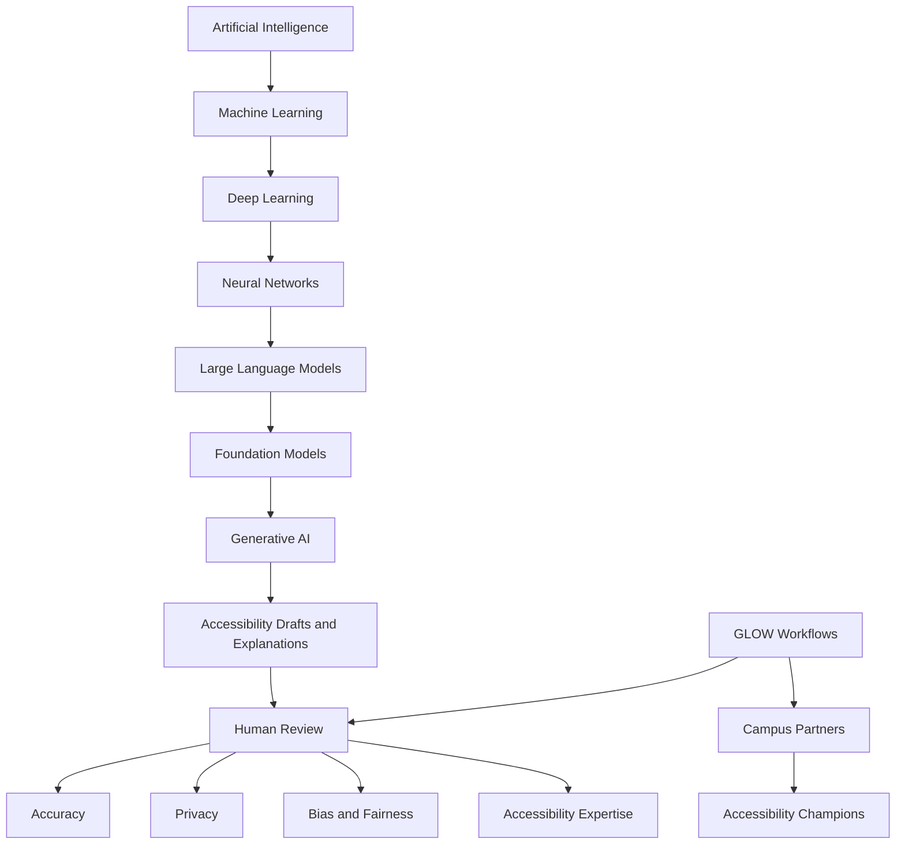

# Module 1 - AI Foundations

## What I Learned

Module 1 helped me distinguish between language generation and trustworthy
knowledge. Large language models can produce useful explanations, but they do
not own truth, context, policy, or accessibility responsibility.

## Capstone Connection

For the GLOW Accessibility Champion Lab, AI is not the center of the system.
Human-centered accessibility capacity building is the center. AI can support
drafts, examples, checklists, and coaching, but every meaningful accessibility
decision requires human review.

## Concept Map

The map below shows the technical spine from AI to generative output, and the
human-centered path from GLOW workflows to accessibility champions. Human
Review is the hub connecting both chains.

### Text Description

The following outline describes the same relationships shown in the diagram
above. It serves as the accessible long description (WCAG 1.1.1) for any
context where the image cannot be perceived.

**Technical spine** — each step is a narrower subset of the one before:

- Artificial Intelligence
  - leads to Machine Learning
    - leads to Deep Learning
      - leads to Neural Networks
        - leads to Large Language Models
          - leads to Foundation Models
            - leads to Generative AI

**From generation to responsible use:**

- Generative AI produces Accessibility Drafts and Explanations.
- Those drafts always pass through Human Review.
- Human Review checks: Accuracy, Privacy, Bias and Fairness, Accessibility
  Expertise.

**The GLOW path — the human-centered core:**

- GLOW Workflows feed into Human Review.
- GLOW Workflows reach Campus Partners.
- Campus Partners become Accessibility Champions.

**Key relationship:** GLOW workflows translate broad AI capability into narrow,
teachable, human-reviewed accessibility practice. The center of the map is
human-centered accessibility capacity building, not the AI model.

## Artifacts

- AI and accessibility glossary
- Concept map (source: `01-module-ai-foundations/concept-map.mmd`)
- Concept map notes and text description
- LLM exploration log
- Reflection journal entry
- Discussion post draft
